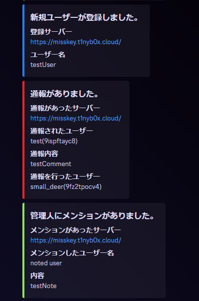

# misskey-admin-notify-webhook-for-discord

[English](./README.md) | Japanese

## これはなに

Misskey から、ユーザーへのメンション・リプライ通知、通報、新規ユーザー登録を Webhook を通して Discord へ通知を送るプログラムです。

Cloudflare Workers 上で動きます。

## どうやって使うの

### Workers 側の設定

Workers へこのプログラムをデプロイしてください。

以下の変数名を Workers に登録する必要があります。

- SECRET
- DISCORD

#### SECRET

任意の文字列で問題ありません。

Misskey の Webhook 設定に使用します。

#### DISCORD

Discord の WebhookURL を設定してください。

Webhook についてはこちら

https://support.discord.com/hc/ja/articles/228383668-%E3%82%BF%E3%82%A4%E3%83%88%E3%83%AB-Webhooks%E3%81%B8%E3%81%AE%E5%BA%8F%E7%AB%A0

### Misskey 側の設定

#### 通報・新規ユーザー登録の通知設定

1. コントロールパネルを開く
2. 「Webhook」を選択
3. 「Webhook を作成」を押下
4. 各項目を入力 
   名前：任意の内容 
   URL：Discord の WebhookURL 
   シークレット：Workers で設定した SECRET の内容を入力
5. コントロールパネルから「通報」を選択
6. 「通知設定」を押下
7. 「通報の通知先を追加」を押下
8. 以下項目を入力 
   タイトル：任意の内容 
   通知先の種類：Webhook 
   使用する Webhook：4 で設定した名前

#### ユーザーへのメンション・リプライ通知設定

1. 通知を受け取りたいユーザーでログインする
2. 設定を開く
3. 「Webhook」を選択
4. 「Webhook を作成」を押下
5. 各項目を入力 
   名前：任意の内容 
   URL：Discord の WebhookURL 
   シークレット：Workers で設定した SECRET の内容を入力 
   トリガー：受け取りたい通知を有効にする

## 謝辞

Kabo

https://memo.kabomk.com/misskey-webhook/

[@nakkaa@misskey.7ka.org](https://misskey.7ka.org/@nakkaa)

https://gist.github.com/nakkaa/b304e9319bf1b60d2af574f32b40bc1a
