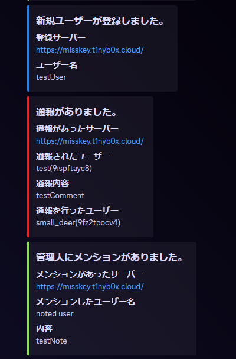

# misskey-admin-notify-webhook-for-discord

English | [Japanese](./README-ja.md)

## What is this

This repository notifies to discord webhook what notice mention to user, abuse report and new user registration from Misskey.

This program working on cloudflare workers.

## Usage

### Workers side setting

Deploy this program to Workers.

Variable names must be registered with Workers.

- SECRET
- DISCORD

#### SECRET

Any string will do.

Used for Misskey webhook configuration.

#### DISCORD

Set the Discord WebhookURL.

About Webhook

https://support.discord.com/hc/en-us/articles/228383668-Intro-to-Webhooks

### Misskey side setting

#### Notification settings for abuse report and new user registration

1. Open Control Panel
2. Select "Webhook"
3. Click "Create Webhook"
4. Enter each item 
   Name: Any value can be applied 
   URL: Discord Webhook URL 
   Secret: Enter the contents of the SECRET set in Workers
5. Select "Report"
6. Click "Notification setting"
7. Click "Add a recipient for abuse reports"
8. Enter each item 
   Title: Any value can be applied 
   Notification type: Webhook
   Webhook to use: Name set in 4

#### Setting up Mention Reply notifications to users

1. Login as the user you wish to receive notifications from.
2. Open settings
3. Select "Webhook"
4. Click "Create Webhook"
5. Enter each item 
   Name: Any value can be applied 
   URL: Discord Webhook URL 
   Secret: Enter the contents of the SECRET set in Workers 
   Trigger: Enable the notifications you want to receive

## Credit

Kabo

https://memo.kabomk.com/misskey-webhook/

[@nakkaa@misskey.7ka.org](https://misskey.7ka.org/@nakkaa)

https://gist.github.com/nakkaa/b304e9319bf1b60d2af574f32b40bc1a
